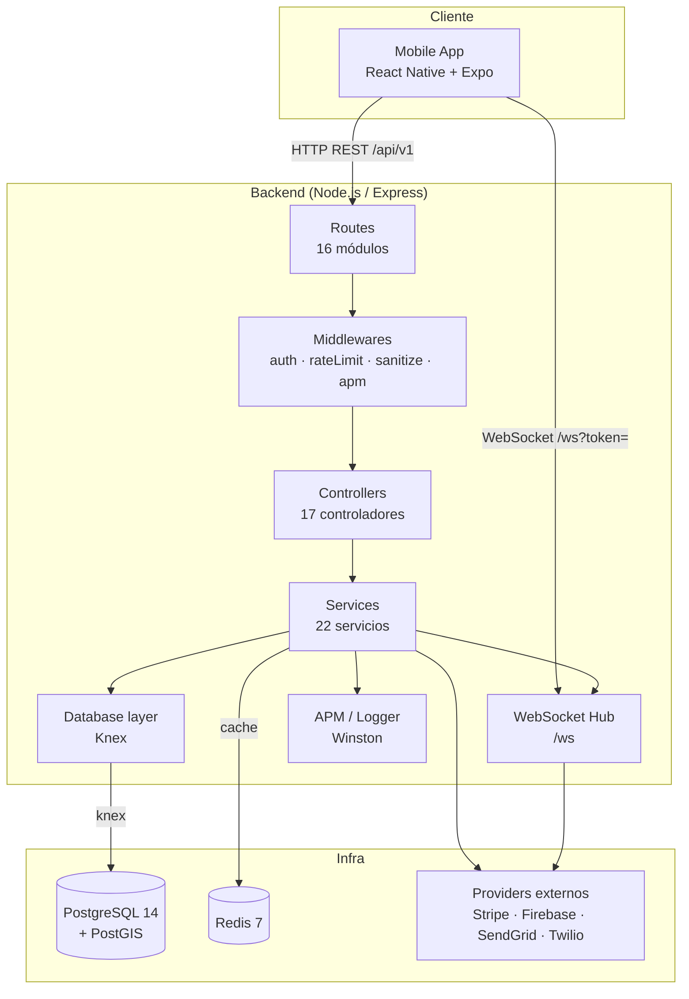
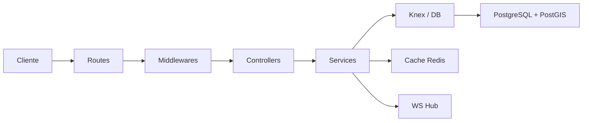
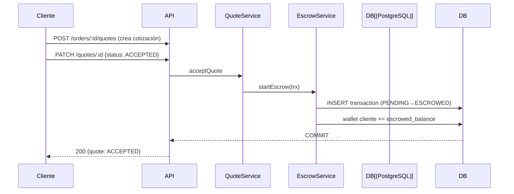
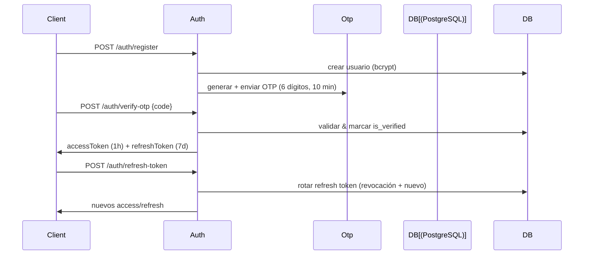
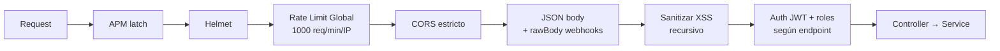

# 🏗️ Arquitectura del Sistema

Vista general de la arquitectura del backend de la plataforma digital on-demand, sus componentes, flujos de datos y decisiones de diseño.

---

## 🎯 Visión general

Plataforma **API-First** desacoplada que conecta **trabajadores independientes (proveedores)** con **clientes**. La lógica vive exclusivamente en el backend (Express), expuesto mediante una API REST versionada (`/api/v1`) y un canal de tiempo real por WebSocket. El frontend (React Native/Expo) es una aplicación separada que solo consume la API.

### Pilares de diseño

- **Modelo de Rol Dual**: un mismo `user_id` alterna dinámicamente entre `client` y `worker/provider` mediante el campo `current_role` incluido en el JWT y evaluado por los middlewares de autorización.
- **Sistema transaccional con Escrow**: los fondos se retienen al aceptar una cotización y solo se liberan al confirmar la entrega, todo dentro de transacciones atómicas.
- **Arquitectura por capas** desacoplada: `routes → controllers → services → database`.
- **API-First**: Swagger/OpenAPI generado desde el código como fuente de verdad del contrato.

---

## 🧩 Diagrama de componentes

---

## 🗂️ Arquitectura en capas

Flujo de una petición: solo las capas superiores dependen de las inferiores. Nunca al revés.

| Capa | Función | Dependencias |
|---|---|---|
| **Routes** | Definición de endpoints y verbos HTTP, aplicación de rate limiters | Express Router |
| **Middlewares** | Auth (JWT + roles), rate limiting, sanitización XSS, APM/latencia | servicios de auth, logger |
| **Controllers** | Mapeo HTTP → dominio, validación de entrada (Joi), formato de respuestas/errores | services, `validation.js` |
| **Services** | Lógica de negocio, transacciones, integraciones externas | Knex, cache, WS, providers |
| **Database** | Acceso a datos con Knex, ejecución de transacciones | PostgreSQL + PostGIS |
| **Providers** | Envoltorios de servicios externos (notification push/email/sms) | SDKs externos |

### Servicios singleton

Los servicios en `src/services/` se exportan como **singleton** (`export default new ServiceClass()`), lo que permite compartir el estado de conexión (db, cache) y su inyección en controladores y tests.

---

## 📡 Flujo de datos por dominio

### 1. Flujo transaccional (orden + escrow)

> Detalle completo en [ESCROW_SYSTEM.md](./ESCROW_SYSTEM.md).

### 2. Autenticación (JWT + OTP)

> Detalle completo en [AUTHENTICATION.md](./AUTHENTICATION.md).

### 3. Mensajería en tiempo real

- **HTTP** (`/api/v1/messages`): crear, listar, eliminar mensajes; subida de imágenes (Multer + Sharp).
- **WebSocket** (`/ws?token=`): entrega de eventos en tiempo real, auth por token JWT en el handshake, soporte multi-dispositivo (Set de sockets por usuario), relay de "typing".
- Eventos principales: `message:new`, `message:deleted`, `typing:indicator`, `order:status_changed`, `completion_confirmed`, `notification`.

---

## 🗃️ Almacenamiento y caché

- **PostgreSQL 14 + PostGIS 3.4**: datos relacionales + búsquedas geoespaciales (ubicación de trabajadores/asignaciones).
- **Knex 3.x**: query builder y sistema de migraciones/seeds.
- **Redis 7**: caché de datos relativamente inmutables (búsqueda de trabajadores, perfiles públicos) con **fallback automático a caché en memoria** si Redis no está disponible (ver `src/utils/cache.js`).
- **uploads/**: almacenamiento de imágenes adjuntas comprimidas con Sharp.

---

## 🛡️ Seguridad perimetral (orden del middleware)

| Capa | Mecanismo |
|---|---|
| Latencia / monitoreo | `apmMiddleware` (HR-timing, alertas 5xx y latencia alta) |
| Headers de seguridad | `helmet` |
| DDoS / abuso | rate limit global + específicos (orden, auth) |
| Origen permitido | CORS con `ALLOWED_ORIGINS` |
| XSS | sanitización recursiva de `body/query/params` |
| Inyección SQL | parámetros parametrizados de Knex (prepared statements) |
| Auth | JWT + refresh tokens + middleware de roles |

---

## 🧠 Decisiones de arquitectura destacadas

1. **JavaScript (ESM) en lugar de TypeScript**: el proyecto se mantiene en JS puro con módulos ES, Babel solo para Jest. Los controllers hacen validación fuerte con Joi y comentarios JSDoc para compensar la falta de tipado estático.
2. **Transacciones atómicas para dinero**: `EscrowService` recibe `trx` (transacción Knex) iniciada por el llamador, garantizando que pago + wallet + cambio de estado + logs compartan el mismo `COMMIT`/`ROLLBACK`. Ver [ESCROW_SYSTEM.md](./ESCROW_SYSTEM.md).
3. **Estado del rol dinámico (Rol Dual)**: se transporta `current_role` en el JWT y `requireRole()` valida permisos por rol. Los roles `worker` y `provider` se tratan como equivalentes para compatibilidad de naming. Ver [AUTHENTICATION.md](./AUTHENTICATION.md).
4. **Providers lazy-init**: las integraciones de notificación (Firebase/SendGrid/Twilio) se inicializan solo cuando se usan y degradan con gracia si no hay credenciales, evitando fallos de arranque en desarrollo.
5. **WebSocket nativo (`ws`)**: se evita una abstracción pesada (Socket.IO); el hub gestiona conexiones, autenticación, multi-dispositivo y enrutado de eventos en `~130` líneas.

---

## 🔗 Documentos relacionados

- [README.md](./README.md) — índice de la documentación.
- [DATABASE_SCHEMA.md](./DATABASE_SCHEMA.md) — modelo de datos completo.
- [ORDER_STATE_MACHINE.md](./ORDER_STATE_MACHINE.md) — ciclo de vida de órdenes.
- [API_DESIGN.md](./API_DESIGN.md) — convenciones de la API.
- [CODE_STANDARDS.md](./CODE_STANDARDS.md) — estructura de carpetas y estilo.
