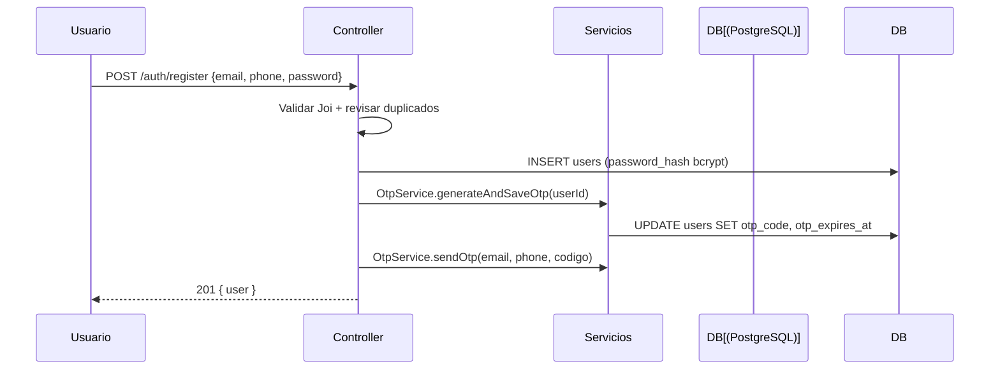
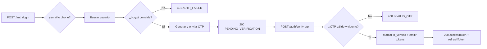

# 🔐 Autenticación y Autorización

Flujos completos de autenticación (registro, login, OTP, JWT, refresh, recuperación de contraseña) y autorización basada en el **rol dual**.

---

## 🧠 Panorama

El sistema usa un esquema de **verificación en dos pasos (2FA/OTP)** combinado con **JWT**:

1. **Registrar / Login** → genera y envía un **OTP de 6 dígitos** (Email/SMS).
2. **Verificar OTP** → emite el par de tokens: `accessToken` + `refreshToken`.
3. El `accessToken` (corto, 1h) protege las peticiones API.
4. El `refreshToken` (largo, 7d, rotativo y almacenado en BD) renueva la sesión.

Concurren con esto: el **modelo de rol dual** (`current_role`), seguridad de contraseñas con **bcrypt**, y **rate limiting** en los endpoints sensibles.

---

## 🔑 Tokens

### accessToken

- Algoritmo: `HS256` (`jsonwebtoken`), firmado con `JWT_SECRET`.
- **Payload**: `{ user_id, email, current_role, iat, exp }`.
- **Vigencia**: 1 hora.

```json
{
  "user_id": "a1b2c3d4-...",
  "email": "cliente@example.com",
  "current_role": "client",
  "iat": 1720000000,
  "exp": 1720003600
}
```

### refreshToken

- Firmado con `REFRESH_TOKEN_SECRET` (secreto distinto del access).
- **Payload**: `{ user_id, jti, exp }`.
- **Vigencia**: 7 días.
- **Almacenado en BD** (tabla `refresh_tokens`) para **revocación**.
- **Rotación**: cada uso emite un token nuevo y **revoca el anterior** (`jti` único). Un refresh token ya usado no puede reutilizarse (seguridad anti-replay).

### Roles (Rol Dual)

- `current_role` viaja en el JWT: `client` o `worker` (alias `provider`).
- Al cambiar de rol se emite un nuevo `accessToken` con el rol actualizado.
- El middleware `requireRole([...])` valida permisos y trata `worker` y `provider` como equivalentes.

---

## 📍 Endpoints de autenticación

Todos bajo `/api/v1/auth` y protegidos por el **rate limiter de auth** (5 intentos fallidos / 15 min / IP).

| Método | Ruta | Descripción | Respuesta |
|---|---|---|---|
| `POST` | `/register` | Crea usuario (bcrypt) y envía OTP | `201` |
| `POST` | `/login` | Valida credenciales y envía OTP | `200 PENDING_VERIFICATION` |
| `POST` | `/verify-otp` | Valida OTP → emite tokens | `200 {accessToken, refreshToken}` |
| `POST` | `/refresh-token` | Rota el refresh token → nuevos tokens | `200 {accessToken, refreshToken}` |
| `POST` | `/forgot-password` | Envía código de recuperación (30 min) | `200` |
| `POST` | `/verify-reset-code` | Valida código → token temporal (10 min) | `200 {token}` |
| `POST` | `/reset-password` | Nueva contraseña con token temporal | `200` |

---

## 🔁 Flujos

### 1. Registro + verificación



- El OTP (6 dígitos) **expira en 10 minutos**.
- El envío es por **proveedor simulado** (ver `OtpService`) sustituible por Twilio/SendGrid.

### 2. Login + verificación



### 3. Renovación de tokens (rotación)

```mermaid
flowchart LR
    A[POST /auth/refresh-token {refreshToken}] --> B[Verificar firma]
    B --> C{Buscar jti en BD}
    C -- No existe / expirado --> D[401 INVALID_REFRESH_TOKEN]
    C -- Existe y vigente --> E[Eliminar refresh token viejo]
    E --> F["Emite nuevo access (1h) + refresh (7d)"]
    F --> G[Guardar nuevo refresh en BD]
    G --> H[200 accessToken + refreshToken]
```

Server-side durante el refresh: **se revoca el token anterior** y el usuario debe estar `active`; si no, `null` → `401`.

### 4. Recuperación de contraseña

```mermaid
flowchart LR
    A[POST /auth/forgot-password] --> B[Generar reset_code de 6 dígitos (30 min)]
    B --> C[Guardar reset_code + reset_expires_at]
    C --> D[200 código enviado]
    D --> E[POST /auth/verify-reset-code]
    E --> F{¿código válido y vigente?}
    F -- No --> G[400 INVALID_RESET_CODE]
    F -- Sí --> H[Generar token temporal 10 min]
    H --> I[200 { token }]
    I --> J[POST /auth/reset-password {token, password}]
    J --> K[Verificar firma con hash actual = single-use]
    K --> L[Actualizar password_hash]
    L --> M[200 contraseña restablecida]
```

- El token temporal de reset se firma con `JWT_RESET_SECRET + password_hash` del usuario, lo que lo convierte en **monouso**: si la contraseña cambia, el token deja de ser válido. Ver `AuthService.generateResetPasswordToken`.

---

## 🛡️ Middleware de autorización

### `authenticateToken` (`src/middlewares/authMiddleware.js`)

- Extrae `Bearer <token>` del header `Authorization`.
- Sin token → `401 UNAUTHORIZED`.
- Token inválido/expirado → `403 FORBIDDEN`.
- Éxito → inyecta `req.user = decoded` (payload) y propaga `user_id` al logger (AsyncLocalStorage).

### `requireRole([...])` 

- Valida `req.user.current_role` contra la lista permitida.
- `worker` y `provider` se consideran equivalentes.
- Sin autenticación → `401`; sin permiso → `403 FORBIDDEN`.

```js
// Ejemplo de uso en una ruta
router.get('/orders', authenticateToken, requireRole(['client']), orderController.list);
```

---

## 🔒 Seguridad adicional

| Medida | Detalle |
|---|---|
| **Password hashing** | bcrypt (10 rondas) en el registro y reset. |
| **Rate limiting auth** | 5 intentos fallidos / 15 min / IP (`authRateLimiter`); se reinicia al autenticarse con éxito. |
| **Secreto separado** | `accessToken` y `refreshToken` usan secretos distintos (`JWT_SECRET`, `REFRESH_TOKEN_SECRET`). |
| **Rotación + revocación** | Los refresh tokens se rotan y revocan para mitigar replay. |
| **Single-use reset** | Token de reset firmado con el hash actual de la contraseña. |
| **OPC** | OTP de 6 dígitos con expiración de 10 min; se borra tras éxito. |
| **Sin datos sensibles** | El logger no registra tokens, contraseñas ni hash. |

### Variables de entorno requeridas

```
JWT_SECRET=tu_secreto_seguro_para_jwt
REFRESH_TOKEN_SECRET=tu_secreto_seguro_para_refresh_tokens
JWT_RESET_SECRET=tu_secreto_para_tokens_de_reset
```

---

## 🔗 Documentos relacionados

- [API_DESIGN.md](./API_DESIGN.md) — formato de respuestas/errores y convenciones.
- [DATABASE_SCHEMA.md](./DATABASE_SCHEMA.md) — tablas `users` y `refresh_tokens`.
- [DEVELOPMENT.md](./DEVELOPMENT.md) — setup local para probar los flujos.
