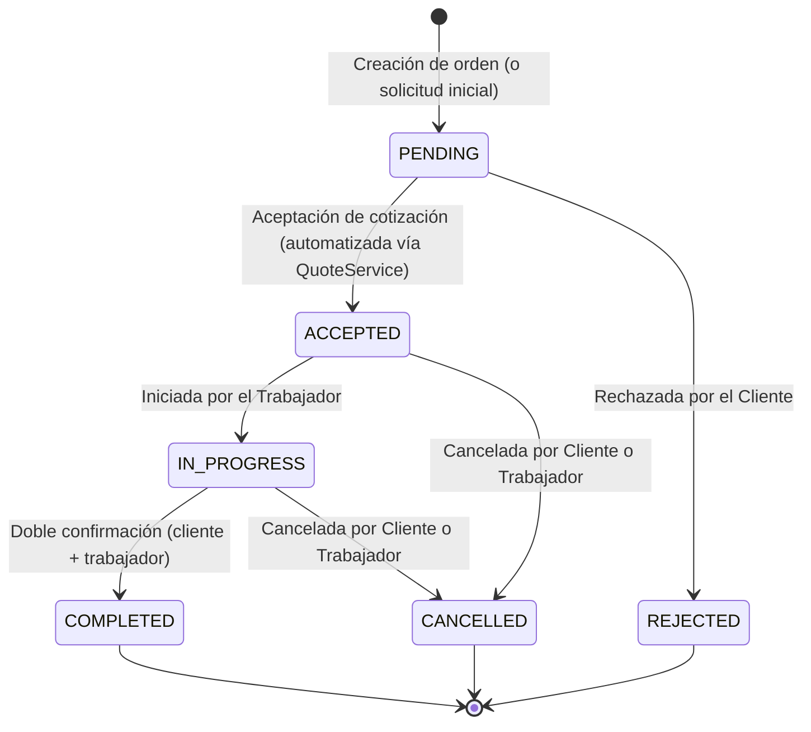

# Máquina de Estados de Órdenes

Este documento detalla los estados permitidos, las transiciones válidas y las reglas de negocio asociadas con el ciclo de vida de una orden (pedido de servicio) en la plataforma.

## Diagrama de Transición de Estados

## Reglas de Transición y Actores

| Estado Inicial | Estado Destino | Actor Permitido | Descripción / Validación |
| :--- | :--- | :--- | :--- |
| `PENDING` | `ACCEPTED` | Automatizado / Cliente | Se gatilla únicamente cuando el cliente acepta una cotización activa asociada a la orden a través del `QuoteService`. |
| `PENDING` | `REJECTED` | Cliente | El cliente rechaza o cancela la solicitud inicial antes de que se acepte cualquier propuesta. |
| `ACCEPTED` | `IN_PROGRESS` | Trabajador | El trabajador asignado inicia el servicio formalmente. |
| `ACCEPTED` | `CANCELLED` | Cliente / Trabajador | Se cancela el servicio programado de común acuerdo o de manera unilateral antes de iniciar el trabajo. |
| `IN_PROGRESS` | `COMPLETED` | Cliente + Trabajador | Requiere **doble confirmación**: el cliente (obligatorio) y el trabajador (opcional) confirman la finalización vía `POST /orders/:id/complete`. Cuando ambos confirman, la orden transiciona a `COMPLETED` y se libera el escrow. |
| `IN_PROGRESS` | `CANCELLED` | Cliente / Trabajador | Cancelación durante la ejecución del servicio (puede requerir lógica de mediación posterior). |

## Auditoría y Eventos

Cada transición de estado exitosa se registra de forma atómica en la tabla `order_events` para mantener un historial inmutable de auditoría:
*   `id`: UUID Clave primaria.
*   `order_id`: UUID que asocia el evento a la orden.
*   `user_id`: UUID del actor (usuario autenticado) que ejecutó la transición.
*   `from_state`: Estado anterior de la orden.
*   `to_state`: Estado nuevo de la orden.
*   `created_at`: Fecha y hora del evento.

## Notificaciones en Tiempo Real

Al realizar una transición de estado, el sistema notifica automáticamente a los participantes (tanto cliente como trabajador) a través de WebSocket emitiendo el evento `order:status_changed` con el payload de la orden actualizada.

## Confirmación de Finalización (Doble Confirmación)

El endpoint `POST /orders/:id/complete` implementa un modelo de confirmación dual para la transición `IN_PROGRESS → COMPLETED`:

- **Cliente (obligatorio)**: Debe confirmar la finalización del servicio para que la orden pueda completarse.
- **Trabajador (opcional)**: Puede confirmar la finalización, pero su falta no bloquea la transición una vez que el cliente confirma.

**Comportamiento:**
1. Cualquier participante (cliente o trabajador) puede llamar al endpoint con `{ "confirm": true }` (default) para registrar su confirmación.
2. Con `{ "confirm": false }` se revoca una confirmación previa del llamante.
3. Cuando **ambos** (`client_confirmed` y `worker_confirmed`) son `true`, la orden transiciona automáticamente a `COMPLETED` y se libera el escrow al trabajador (`releaseFunds`).
4. El sistema emite el evento WebSocket `order:completion_confirmed` con payload `{ order_id, client_confirmed, worker_confirmed, status }` a ambos participantes.

**Restricciones:**
- La orden debe estar en estado `IN_PROGRESS`. Si no, retorna `INVALID_TRANSITION` (409).
- El llamante debe ser cliente o trabajador de la orden (si no, `FORBIDDEN` 403).
- Una confirmación ya registrada no puede duplicarse (`ALREADY_CONFIRMED` 409).

**Columnas de auditoría en `orders`:** `client_confirmed`, `worker_confirmed`, `client_confirmed_by`, `worker_confirmed_by`, `client_confirmed_at`, `worker_confirmed_at`.

